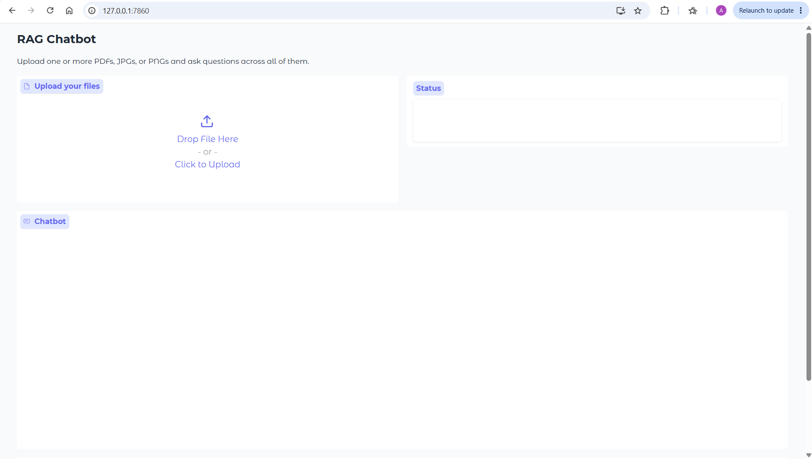
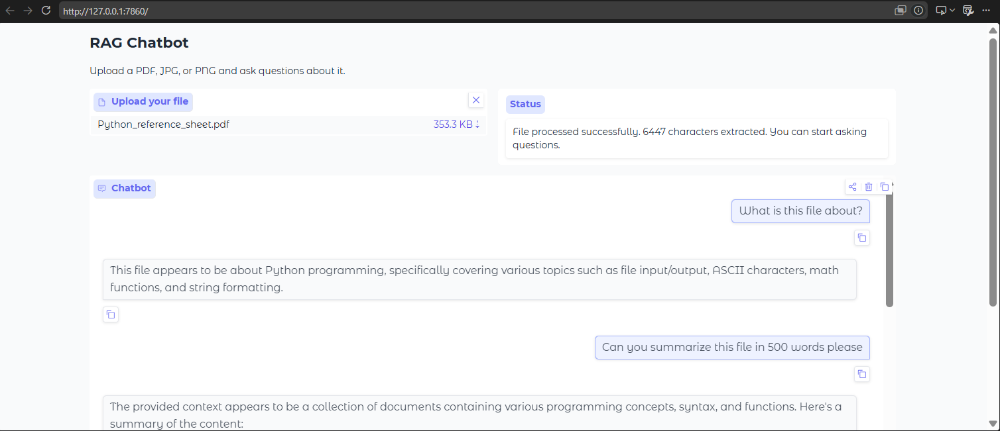
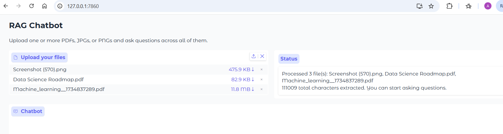

# RAG Chatbot

A retrieval-augmented generation (RAG) chatbot that lets users upload their own documents and ask questions about them. Built with LangChain, Groq, and Gradio.

## Demo

> Run locally and upload a PDF, JPG, or PNG to start chatting with your documents.

### Upload your documents


### Ask questions and get answers


### Works with multiple files at once


## Features

- Upload PDF, JPG, or PNG files and ask questions about them
- Supports multiple files at once, chat across all of them
- Per-user session isolation, multiple users don't interfere with each other
- OCR support for images using Tesseract
- Powered by Llama 3.3 70B via Groq API (free)
- Local embeddings using HuggingFace sentence-transformers (no API cost)

## Tech Stack

| Layer | Tool |
|---|---|
| LLM | Groq (Llama 3.3 70B) |
| Embeddings | HuggingFace sentence-transformers |
| Vector Store | ChromaDB |
| Framework | LangChain |
| Backend | FastAPI |
| Frontend | Gradio |

## Architecture
User uploads file (PDF / JPG / PNG)
↓
Extract text (PyPDF for PDFs, Tesseract OCR for images)
↓
Chunk text and embed using sentence-transformers
↓
Store in per-session ChromaDB vector store
↓
User asks question → retrieve top-k chunks → Groq LLM answers

## Setup

**1. Clone the repo**
```bash
git clone https://github.com/AyushiPatel266/rag-chatbot.git
cd rag-chatbot
```

**2. Create virtual environment**
```bash
python -m venv venv
venv\Scripts\activate  # Windows
source venv/bin/activate  # Mac/Linux
```

**3. Install dependencies**
```bash
pip install -r requirements.txt
```

**4. Install Tesseract (for image OCR)**

Windows: Download from [UB-Mannheim/tesseract](https://github.com/UB-Mannheim/tesseract/wiki)

**5. Add your API key**

Create a `.env` file in the root:
GROQ_API_KEY=your_groq_key_here
Get a free key at [console.groq.com](https://console.groq.com)

**6. Run the app**
```bash
python app.py
```

Open `http://localhost:7860` in your browser.

## Project Structure

rag-chatbot/
├── app/
│   ├── config.py         # API keys and settings
│   ├── ingest.py         # Document loading and chunking
│   └── rag_pipeline.py   # Retrieval chain
├── app.py                # Gradio frontend
├── requirements.txt
└── .env                  # not committed
